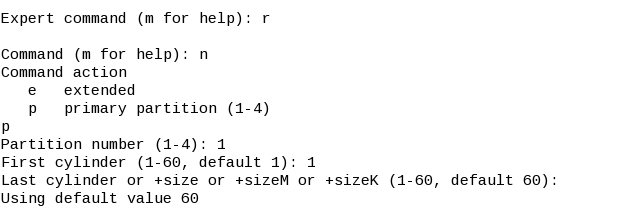

# Linux Note
## route
直接使用就是查看路由与网关  

设置和查看路由表都可以用 route 命令，设置内核路由表的命令格式是：

    route  [add|del] [-net|-host] target [netmask Nm] [gw Gw] [[dev] If]
其中：
add : 添加一条路由规则  

del : 删除一条路由规则  

-net : 目的地址是一个网络  

-host : 目的地址是一个主机  

target : 目的网络或主机  

netmask : 目的地址的网络掩码  

gw : 路由数据包通过的网关  

dev : 为路由指定的网络接口

## SCP
    scp xxx@10.0.2.2: /path .
拷贝远程目标文件至本地

    scp xxx@10.0.2.2: /path/* .
拷贝远程文件夹下所有文件至本地  

从本地拷贝至远程：

    scp /home/test/test.txt root@192.168.0.2:/home/test/ .

## ls

显示指定工作目录下之内容 

    ls [-alrtAFR] [name...]

-a 显示所有文件及目录 (ls内定将文件名或目录名称开头为"."的视为隐藏档，不会列出)  

-l 除文件名称外，亦将文件型态、权限、拥有者、文件大小等资讯详细列出  

-t 将文件依建立时间之先后次序列出  

-F 在列出的文件名称后加一符号；例如可执行档则加 "*", 目录则加 "/"  

-R 若目录下有文件，则以下之文件亦皆依序列出  

## fdisk

创建以及维护分区表的命令

    fdisk -l 
    
    fdisk disk.img

## mount
主要用于挂载文件

    mount disk1.img mydisk/ -text -o loop,offset=32256

-o loop：使用 loop 模式用来将一个档案当成硬盘分割挂上系统。
将disk.img挂载到mydisk/目录下

## umount
    umount -v /dev/sda1          通过设备名卸载  
    umount -v /mnt/mymount/      通过挂载点卸载
umount可卸除目前挂在Linux目录中的文件系统  
-a 卸除/etc/mtab中记录的所有文件系统。  
-h 显示帮助。  
-n 卸除时不要将信息存入/etc/mtab文件中。  
-r 若无法成功卸除，则尝试以只读的方式重新挂入 文件系统。  
-t<文件系统类型> 仅卸除选项中所指定的文件系统。  
-v 执行时显示详细的信息。  
-V 显示版本信息。  

## dhcpcd

    dhcpcd

直接输入静态配置IP即可

## mv

    mv [options] source dest
    mv [options] source... directory

options:  
-i: 若指定目录已有同名文件，则先询问是否覆盖旧文件;  
-f: 在 mv 操作要覆盖某已有的目标文件时不给任何指示;

## losetup -o 32256 /dev/loop disk1.img

## mke2fs /dev/loop

## rm -r

    rm [options] name...

options: 

-i 删除前逐一询问确认。 

-f 即使原档案属性设为唯读，亦直接删除，无需逐一确认。  

-r 将目录及以下之档案亦逐一删除。

## dd
dd可从标准输入或文件中读取数据，根据指定的格式来转换数据，再输出到文件、设备或标准输出。
可以用于创建启动盘以及虚拟磁盘

    dd if=/dev/zero of=disk.img bs=1k count=32760
    dd if=memos-1 of=c1.img conv=notrunc

if=文件名：输入文件名，默认为标准输入。即指定源文件。  

of=文件名：输出文件名，默认为标准输出。即指定目的文件。  

+ ibs=bytes：一次读入bytes个字节，即指定一个块大小为bytes个字节。  
+ obs=bytes：一次输出bytes个字节，即指定一个块大小为bytes个字节。  
+ bs=bytes：同时设置读入/输出的块大小为bytes个字节。  

cbs=bytes：一次转换bytes个字节，即指定转换缓冲区大小。

skip=blocks：从输入文件开头跳过blocks个块后再开始复制。

seek=blocks：从输出文件开头跳过blocks个块后再开始复制。

count=blocks：仅拷贝blocks个块，块大小等于ibs指定的字节数。

conv=<关键字>，关键字可以有以下11种：
+ conversion：用指定的参数转换文件。  
+ ascii：转换ebcdic为ascii  
+ ebcdic：转换ascii为ebcdic  
+ ibm：转换ascii为alternate ebcdic  
+ block：把每一行转换为长度为cbs，不足部分用空格填充  
+ unblock：使每一行的长度都为cbs，不足部分用空格填充  
+ lcase：把大写字符转换为小写字符  
+ ucase：把小写字符转换为大写字符  
+ swab：交换输入的每对字节  
+ noerror：出错时不停止  
+ notrunc：不截短输出文件  
+ sync：将每个输入块填充到ibs个字节，不足部分用空（NUL）字符补齐。  

## qemu-system-i386 -hda vga_test

## pwd

显示工作目录

## vi

## chmod +x

    chmod [-cfvR] [--help] [--version] mode file...
    
u 表示该文件的拥有者，

g 表示与该文件的拥有者属于同一个群体(group)者，

o 表示其他以外的人，

a 表示这三者皆是。

“+”表示增加权限、- 表示取消权限、= 表示唯一设定权限。

r 表示可读取，w 表示可写入，x 表示可执行，X 表示只有当该文件是个子目录或者该文件已经被设定过为可执行。

    chmod u+x ex1.py

eg：将 ex1.py 设定为只有该文件拥有者可以执行 :

    chmod u+x ex1.py

## cat

## hexdump
hexdump命令一般用来查看“二进制”文件的十六进制编码，但实际上它能查看任何文件，而不只限于二进制文件。 

    hexdump -b test.txt
    hexdump: [-bcCdovx] [file ...]

+ -b：每个字节显示为8进制。一行共16个字节，一行开始以十六进制显示偏移值
+ -c：每个字节显示为ASCII字符
+ -C：每个字节显示为16进制和相应的ASCII字符
+ -d：两个字节显示为10进制
+ -e：格式化输出
+ -f：Specify a file that contains one or more newline separated format strings.  Empty lines and lines whose first non-blank character is a hash mark (#) are ignored.
+ -n：只格式前n个长度的字符
+ -o：两个字节显示为8进制
+ -s：从偏移量开始输出
+ -v：The -v option causes hexdump to display all input data.  Without the -v option, any number of groups of output lines, which would be identical to the immediately preceding group of output lines
+ -x：双字节十六进制显示

## openssl md5 c2.img

## objdump -d memos2 | less
objdump命令是用查看目标文件或者可执行的目标文件的构成的gcc工具。
>显示文件头信息

    objdump -f test

>显示Section Header信息
    
    objdump -h test

>显示全部Header信息
    
    objdump -x test

>显示全部Header信息，并显示对应的十六进制文件代码

    objdump -s test

>输出目标文件的符号表

    objdump -t obj

>输出目标文件的所有段概述

    objdump -h obj

>反汇编test中的需要执行指令的那些section
    
    objdump -d test

>反汇编test中的所有section
    
    objdump -D test

>反汇编出源码(指定section)

    objdump -Slj .text obj

>对任意二进制文件进行反汇编
    
    objdump -D -b binary -m i386 a.bin

## as 