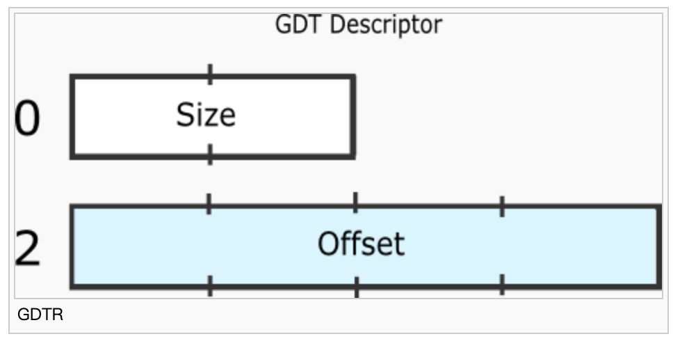

# Linux basic knowledge

## ELF

ELF (Executable and Linkable Format)

ELF是一种将程序或程序片段存储在磁盘上的格式，该格式是由于编译和链接而创建的。ELF文件分为几部分。对于可执行程序，这些是代码的文本部分，全局变量的数据部分和通常包含常量字符串的rodata部分。ELF文件包含描述这些部分应如何存储在内存中的标头。

根据其是否是可执行文件或者链接文件，elf的header会不一样：

    process.o, result of gcc -c process.c $SOME_FLAGS

    C32/kernel/bin/.process.o
    architecture: i386, flags 0x00000011:
    HAS_RELOC, HAS_SYMS
    start address 0x00000000

    Sections:
    Idx Name          Size      VMA       LMA       File off  Algn
     0 .text         00000333  00000000  00000000  00000040  2**4
                  CONTENTS, ALLOC, LOAD, RELOC, READONLY, CODE
     1 .data         00000050  00000000  00000000  00000380  2**5
                  CONTENTS, ALLOC, LOAD, DATA
     2 .bss          00000000  00000000  00000000  000003d0  2**2
                  ALLOC
     3 .note         00000014  00000000  00000000  000003d0  2**0
                  CONTENTS, READONLY
     4 .stab         000020e8  00000000  00000000  000003e4  2**2
                  CONTENTS, RELOC, READONLY, DEBUGGING
     5 .stabstr      00008f17  00000000  00000000  000024cc  2**0
                  CONTENTS, READONLY, DEBUGGING
     6 .rodata       000001e4  00000000  00000000  0000b400  2**5
                  CONTENTS, ALLOC, LOAD, READONLY, DATA
     7 .comment      00000023  00000000  00000000  0000b5e4  2**0
                  CONTENTS, READONLY

flags表明可用的内容  
/bin/bash, a real executable file  
程序头本身...占用224个字节，并从文件中的偏移量0x34开始

    bin/bash:     file format elf32-i386
    /bin/bash
    architecture: i386, flags 0x00000112:
    EXEC_P, HAS_SYMS, D_PAGED
    start address 0x08056c40

    Program Header:
        PHDR off    0x00000034 vaddr 0x08048034 paddr 0x08048034 align 2**2
            filesz 0x000000e0 memsz 0x000000e0 flags r-x

## flag register
标志寄存器设计为16位，实际使用9位，其中6位用以存放算术逻辑单元运算后的结果特征，称为状态标志；另外3位通过人为设置，用以控制8086的三种特定操作，称为控制标志。每一个标志位的定义参考：https://blog.csdn.net/weixin_42109012/article/details/100148721

## GDT
的全局描述符表（GDT）是特定于IA32架构。它包含一些条目，它们告诉CPU有关内存段的信息。存在类似的中断描述符表，其中包含任务和中断描述符。  

该偏移量是表本身，即寻呼适用的装置的线性地址。的大小是由1减去表的大小。这是因为的最大值大小为65535，而GDT可高达65536个字节（最高8192个条目）。此外，GDT的大小不能为0。  
该表包含8字节条目。每个条目都有一个复杂的结构：
https://www.cnblogs.com/bajdcc/p/8972946.html